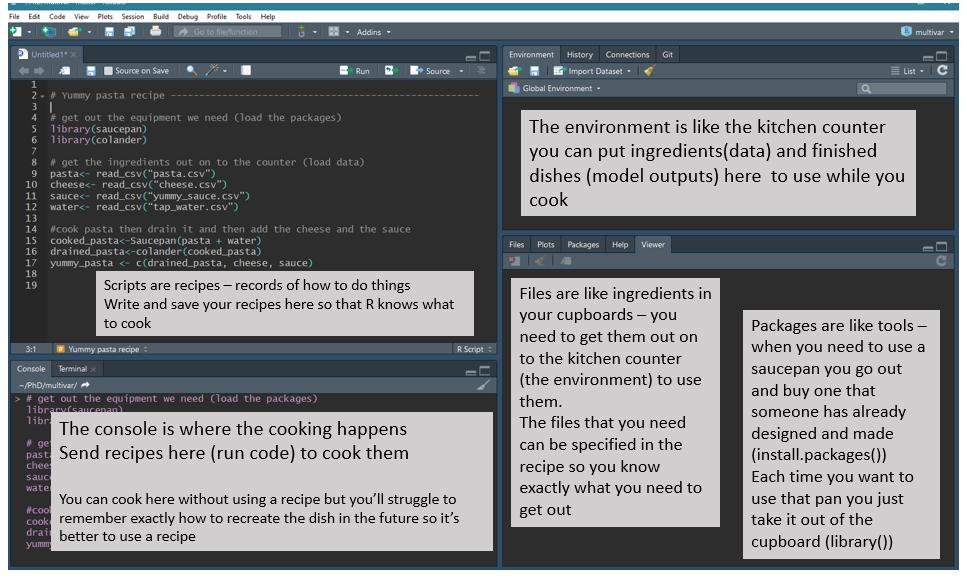
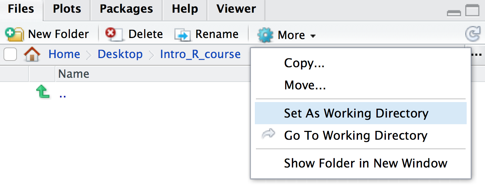

# Introduction to RStudio

RStudio is an interface that makes it easier to use R. There are four windows in RStudio. The screenshot below shows an [analogy linking the different RStudio windows to cooking](https://twitter.com/RLadiesNCL/status/1138812826917724160).



\  
\  
\  


## Working directory
Every file on your computer is located in a specific location. This location can be referred to by a path. In Mac, paths look something like this: `/Users/doylemaria/Documents/`. In Windows, paths look something like this: `C:\Users\doylemaria\Documents\`.

When you open a RStudio session, it launches from a specific location. You can find out where this is using the command `getwd()`. This location called the ‘working directory’. R will, by default, look in this directory when reading in data and write out files/plots to this directory. It is often useful to have your data and R Scripts in the same directory and set this as your working directory.

You can set your working directory to be anywhere you like and we will now do this:

Make a folder for this course, somewhere sensible on your computer that you will be able to easily find. Name the folder for example, `Intro_R_course`.

Go back to your RStudio window, go to the bottom right panel, click on the ‘Files’ tab and then click on the three dots on the top right hand corner, as shown below.


This will open up a new window which lets you explore the files and folders on your computer. Find the new folder you created (e.g. `Intro_R_course`), click on it, then click ‘Open’.

The files tab will now show the contents of your new folder (which should be empty). At the top of the files tab, click on `More > Set As Working Directory`, as shown below.




### Data files
The data files required for this workshop are available on [GitHub](https://github.com/PMacDaSci/r-intro-biologists/tree/master/data). To download the data.zip file, click on the file then click 'Download'. Unzip the file and store this `data` folder in your working directory.


### Tidyverse

{width=100% }

The **tidyverse** is a collection of packages that includes  **`ggplot2`** and we will introduce you to some of these packages in this course.

\  
\  
\  

{width=50% }

\  
\  
\ 

**The [tidyverse](https://www.tidyverse.org/) makes data science faster, easier and more fun.**

\  
\  
\  

To install the tidyverse package you can use the `install.packages` function.

```{r, eval=FALSE}
install.packages('tidyverse')
```


### RNA-seq dataset
In this tutorial, we will learn some R through creating plots to visualise data from an RNA-seq experiment. We will create some plots using published RNA-seq data from the paper by [Fu et al. 2015](https://www.ncbi.nlm.nih.gov/pubmed/25730472). This study examined expression in basal and luminal cells from mice at different stages (virgin, pregnant and lactating). There are 2 samples per group and 6 groups, 12 samples in total. In this first session we will generate some plots to explore the data, to see if it looks ok.


We will use the raw counts here. These are the counts of reads for each gene for each sample. The higher the number of counts the more the gene is expressed.
\  
\  

## Loading the data

First let's open a new R script. From the top menu in RStudio: `File > New File > R Script`.
Let's save it as `intro.R`.

We will begin by loading in the packages that we need.

```{r, message=FALSE}
library(tidyverse)
```

`library()` is the **function** in R that we use to load packages. We will see many functions in the course. Functions are "canned scripts" that automate more complicated sets of commands. Many functions are predefined, or can be made available by importing R *packages*. A function usually takes one or more inputs called *arguments*. Here tidyverse is the argument to the `library()` function. Note that functions require parentheses after the function name.

The file we will use is a csv comma-separated file, so we will use the `read_csv()` function from the tidyverse **`readr`** package to read it in. Tsv stands for  There is also a `read_tsv()` function for tab-separated values.

To see what the `read_csv()` function (or any function in R) does, type a `?` before the name and the help will appear in the Help panel on the right in RStudio. Or you can search the function name in the Help panel search box.

```{r, eval=FALSE}
?read_csv
```

We will use the counts file called `GSE60450_GeneLevel_Normalized(CPM.and.TMM)_data.csv` that's in a folder called `data` i.e. the path to the file should be `data/GSE60450_GeneLevel_Normalized(CPM.and.TMM)_data.csv`.

We can read the counts file into R with the command below. We'll store the contents of the counts file in an **object** called `counts`. This stores the file contents in R's memory making it easier to use.

```{r}
# read in counts file
counts <- read_csv("data/GSE60450_GeneLevel_Normalized(CPM.and.TMM)_data.csv")

# read in metadata
sampleinfo <- read_csv("data/GSE60450_filtered_metadata.csv")

```

In R we use `<-` to assign values to objects. `<-` is the **assignment operator**.  It assigns values on the right to objects on the left. So to create an object, we need to give it a name (e.g. `counts`), followed by the assignment operator `<-`, and the value we want to give it. We can give an object almost any name we want but there are some rules and conventions as described [here](https://datacarpentry.org/R-genomics/01-intro-to-R.html#notes_on_objects)

We can read in a file from a path on our computer on on the web and use this as the value. Note that we need to put quotes ("") around file paths.

> #### Assignment operator shortcut
> In RStudio, typing <kbd>Alt</kbd> + <kbd>-</kbd> (push <kbd>Alt</kbd> at the
> same time as the <kbd>-</kbd> key) will write ` <- ` in a single keystroke in a PC, while typing > <kbd>Option</kbd> + <kbd>-</kbd> (push <kbd>Option</kbd> at the
> same time as the <kbd>-</kbd> key) does the same in a Mac. 

The value of `counts` is the contents of the counts file. There is some information output by `read_tsv` on column specifications, this is the data type that `read_tsv` has guessed is contained in each column, we will discuss this more later. 

## Getting to know the data

When assigning a value to an object, R does not print the value. For example, here we don't see what's in the counts or sampleinfo files. But there are ways we can look at the data. We will demonstrate using the `sampleinfo` object.

We can type the name of the object and this will print the first few lines and some information, such as number of rows. 

```{r}
sampleinfo
```

We can also use `dim()` to see the dimensions of an object, the number of rows and columns.

```{r}
dim(sampleinfo)
```

This show us there are 12 rows and 4 columns.

In the Environment Tab in the top right panel in RStudio we can also see the number of rows and columns in the objects we have in our session.

We can also take a look the first few lines with `head()`. This shows us the first 6 lines.

```{r}
head(sampleinfo)
```

We can look at the last few lines with `tail()`. This shows us the last 6 lines. This can be useful to check the bottom of the file, that it looks ok.
```{r}
tail(sampleinfo)
```

Or we can see the whole file with `View()`.

```{r eval=FALSE}
View(sampleinfo)
```

In the Environment tab we can see how many rows and columns the object contains and we can click on the icon to view all the contents in a tab. This runs the command View() for us.

We can see all the column names with `colnames()`.
```{r}
colnames(sampleinfo)
```

We can access individual columns by name using the `$` symbol. For example we can see what's contained in column X1.

```{r}
sampleinfo$X1
```

If we just wanted to see the first 3 values in the column we can specify this using square brackets.

```{r}
sampleinfo$X1[1:3]
```

Other useful commands for checking data are `str()` and `summary()`.

`str()` shows us the structure of our data. It shows us what columns there are, the first few entries, and what data type they are e.g. character or numbers (double or integer).

```{r}
str(sampleinfo)
```

`summary()` generates summary statistics of our data. For numeric columns (columns of type double or integer) it outputs statistics such as the min, max, mean and median. We will demonstrate this with the counts file as it contains numeric data. For character columns it shows us the length (how many rows).

```{r}
summary(counts)
```


# Formatting the data

We will first convert the data into tidy format to make it easier to work with.


```{r}
seqdata <- gather(counts, key=Sample, value=Count, starts_with("GSM"))
```

Let's have a look at the data.
```{r}
seqdata
```


```{r}
allinfo <- full_join(seqdata, sampleinfo, by = c("Sample" = "X1"))
```

Let's have a look at the data.
```{r}
allinfo
```

# Plotting with **`ggplot2`**

**`ggplot2`** is a plotting package that makes it simple to create complex plots. One really great benefit of ggplot2 versus the older base R plotting is that we only need to make minimal changes if the underlying data change or if we decide to change our plot type, for example, from a bar plot to a box plot. This helps in creating publication quality plots with minimal amounts of adjustments and tweaking.

**`ggplot2`** likes data in the 'long' format, also called 'tidy' format, i.e., a column for every variable, and a row for every observation. Well-structured data will save you lots of time
when making figures with **`ggplot2`**. We will discuss tidy data more later in the course.

ggplot graphics are built step by step by adding new elements. Adding layers in
this fashion allows for extensive flexibility and customization of plots.

To build a ggplot, we use the following basic template that can be used for different types of plots. Three things are required for a ggplot:


1. The data
2. The mapping of variables (columns) in the data to visual properties (called aesthetics in ggplot2) of objects in the plot
3. The type of plot – this is called a geom in ggplot2 terminology

There are different geoms we can use to create different types of plot e.g. bar plot versus box plot, to see some of the geoms available see the ggplot2 help or the handy [ggplot2 cheatsheet](https://github.com/rstudio/cheatsheets/raw/master/data-visualization-2.1.pdf).

We can make boxplots to visualise the distribution of the counts for each sample. This helps us to compare the samples and check if any look unusual.

```{r}
ggplot(data=allinfo, mapping=aes(x=Sample, y=Count)) + 
  geom_boxplot()
```

We have generated our first plot!

But it looks a bit weird. It's because we have some genes with extremely high counts. To make it easier to visualise the distributions we usually plot the logarithm of RNA-seq counts. We'll plot the Sample on the X axis and log~2~ Counts on the y axis. We can log the Counts within the `aes()`. (The sample labels are also overlapping each other, we will show how to fix this later)

```{r}
ggplot(data=allinfo, mapping=aes(x=Sample, y=log2(Count))) + 
  geom_boxplot()
```

Box plots are useful summaries, but hide the shape of the distribution. For example, if the distribution is bimodal, we would not see it in a boxplot. An alternative to the boxplot is the **violin plot**, where the shape (of the density of points) is drawn. See here for an example of how differences in distribution may be hidden in box plots but revealed with violin plots. We could also make jitter plots. A **jitter plot** is similar to a scatter plot. It adds a small amount of random variation to the location of each point so they don’t overlap. There are too many points in this case for the jitter plots to be useful but this is just to demonstrate, as [jitter with and without boxplot](https://simplystatistics.org/2019/02/21/dynamite-plots-must-die/) is a commonly used ggplot type. We will also make use of jitter plots later.

#### Exercise 
You can easily make different types of plots with ggplotby using different geoms. If you type "geom" in RStudio, RStudio will show you the different types of geoms you can use. Using the same data (same x and y values)

1. Make a violin plot (geom_violin)
2. Make a jitter plot (geom_jitter)
3. Make a boxplot with a jitter plot overlaid (Hint: you can add multiple geoms with + )

What if we would like to add some colour to the plot, for example, a different colour bar for each sample. 

If we look at the `geom_boxplot` help we can see under the heading called "Aesthetics" that there's an option for colour. Let's try adding that to our plot. We'll specify we want to map the Sample column to `colour=`. As we are mapping colour to a column in our data we need to put this inside the `aes()`.

```{r}
ggplot(data=allinfo, mapping=aes(x=Sample, y=log2(Count), colour=Sample)) + 
  geom_boxplot()
```

Hmm colouring the edges wasn’t quite what we had in mind. Look at the help for `geom_boxplot` to see what other aesthetic we could use. Let's try `fill=` instead.

```{r}
ggplot(data=allinfo, mapping=aes(x=Sample, y=log2(Count), fill=Sample)) + 
  geom_boxplot()
```

That looks better. `fill=` is used to **fill** in areas in ggplot2 plots, whereas `colour=` is used to colour lines and points.

A really nice feature about ggplot is that we can easily colour by another variable e.g. cell type (basal vs luminal) by simply changing the column we give to `fill=`.

#### Exercise 
Colour the plots by other variables (columns) in the metadata file:

1. characteristics
2. immunophenotype
3. `developmental stage` (Check what happens if you don't use backticks)


# Specifying colours

We might want to change the colours. To see what colour names are available you can type `colours()`. Note that here we see the function `c()` for the first time. We use function extremely often in R when we have multiple items that we are *combining*. Here we have two colours we want to use, so we need to use `c()` to combine them to give to `values=`.
```{r}
mycolours <- c("turquoise", "plum", "snow", "mistyrose", "lemonchiffon", "chocolate")
```

Then we give these colours to  `+ scale_fill_manual(values=mycolours)`.

```{r}
ggplot(data=allinfo, mapping=aes(x=Sample, y=log2(Count), fill=characteristics)) + 
  geom_boxplot() +
  scale_fill_manual(values=mycolours)
```

There are built-in colour palettes that can be handy to use, where the sets of colours are predefined. `scale_fill_brewer()` is a popular one (there is also `scale_colour_brewer()`). You can take a look at the help for `scale_fill_brewer()` to see what pallettes are available. There is also an R colours cheatsheet that shows the colours of the palettes [here](https://www.nceas.ucsb.edu/~frazier/RSpatialGuides/colorPaletteCheatsheet.pdf). There's one called "Dark2", let's have a look at that.

```{r}
ggplot(data=allinfo, mapping=aes(x=Sample, y=log2(Count), fill=characteristics)) + 
  geom_boxplot() +
  scale_fill_brewer(palette = "Dark2")
```


#### Exercise
Make a colourblind friendly plot. Hint there are colourblind friendly palettes [here](http://www.cookbook-r.com/Graphs/Colors_(ggplot2)/#a-colorblind-friendly-palette)

# Make subplots for each gene

With ggplot we can easily make subplots using *faceting*. For example we can make stripcharts, plotting expression by groups for each gene. First we'll use `mutate` to add a column with shorter group names to use in the plot as the group names in the characteristics column are quite long.

```{r}
 allinfo <- mutate(allinfo, Group=case_when(                                        
        str_detect(characteristics, "basal.*virgin") ~ "bvirg",
        str_detect(characteristics, "basal.*preg")  ~ "bpreg",
        str_detect(characteristics, "basal.*lact")  ~ "blact",
        str_detect(characteristics, "luminal.*virgin")  ~ "lvirg",
        str_detect(characteristics, "luminal.*preg")  ~ "lpreg",
        str_detect(characteristics, "luminal.*lact")  ~ "llact"
       ))
```

We can make plots for a set of genes.

```{r}
mygenes <- c("Acta2", "COX1", "Csn1s1", "Csn1s2a", "Csn2", "Csn3")
```


These are the top 6 genes with highest count across all samples that can be obtained with group_by and summarise
mygenes <- allinfo %>% 
group_by(gene_symbol) %>% 
summarise(Total_count=sum(Count)) %>% 
top_n(6, Total_count)%>%
pull(gene_symbol)

We filter our data for just these genes of interest.

```{r}
mygenes_counts <- filter(allinfo, gene_symbol %in% mygenes)
```


We can make boxplots for just these genes. We *facet* on the gene_symbol column.

```{r}
ggplot(data=mygenes_counts, mapping=aes(x=Group, y=Count, fill=Group)) +
  geom_boxplot() +
  facet_wrap(~gene_symbol)
```
We only have two values per group so we could just plot the individual points. We could use 
geom_point to make a scatterplot.
```{r}
ggplot(data=mygenes_counts, mapping=aes(x=Group, y=Count)) +
  geom_point() +
  facet_wrap(~gene_symbol)
```
The points are overlapping so we will use geom_jitter which adds a small amount of random variation.

```{r}
ggplot(data=mygenes_counts, mapping=aes(x=Group, y=Count)) +
  geom_jitter() +
  facet_wrap(~gene_symbol)
```

We can colour the groups similar to before using `colour=`.

```{r}
ggplot(data=mygenes_counts, mapping=aes(x=Group, y=Count, colour=Group)) +
  geom_jitter() +
  facet_wrap(~gene_symbol) 
```

## Modifying the plot

### Axis labels and Title

We can change the axis labels and add a title with `labs()`. To change the x axis label we use `labs(x="New name")`. To change the y axis label we use `labs(y="New name")` or we can change them all at the same time.

```{r}
ggplot(data=mygenes_counts, mapping=aes(x=Group, y=Count, colour=Group)) +
  geom_jitter() +
  facet_wrap(~gene_symbol) + 
  labs(x="Cell type and stage", y="Count", title="Mammary gland RNA-seq data")
```

### Themes

We can adjust the text on the x axis (the group labels by turning them 90 degrees so we can read the labels better.
```{r}
ggplot(data=mygenes_counts, mapping=aes(x=Group, y=Count, colour=Group)) +
  geom_jitter() +
  facet_wrap(~gene_symbol) + 
  labs(x="Cell type and stage", y="Count", title="Mammary gland RNA-seq data") +
  theme(axis.text.x = element_text(angle = 90))
```

We can remove the grey background and grid lines. To do this we modify the ggplot theme. Themes are the non-data parts of the plot. 

There are also a lot of built-in themes. Let's have a look at a couple of the more widely used themes. We won't save these (we won't use `p <-`) we'll just print them to have a look. The default ggplot theme is `theme_grey().`

```{r}
ggplot(data=mygenes_counts, mapping=aes(x=Group, y=Count, colour=Group)) +
  geom_jitter() +
  facet_wrap(~gene_symbol) + 
  labs(x="Cell type and stage", y="Count", title="Mammary gland RNA-seq data") +
  theme(axis.text.x = element_text(angle = 90)) + 
  theme_bw()
```

```{r}
ggplot(data=mygenes_counts, mapping=aes(x=Group, y=Count, colour=Group)) +
  geom_jitter() +
  facet_wrap(~gene_symbol) + 
  labs(x="Cell type and stage", y="Count", title="Mammary gland RNA-seq data") +
  theme(axis.text.x = element_text(angle = 90)) + 
  theme_minimal()
```

There are many themes available, you can see some in the [R graph gallery](https://www.r-graph-gallery.com/192-ggplot-themes/).

We can also modify parts of the theme individually. We can remove the grey background and grid lines with the code below.

```{r}
ggplot(data=mygenes_counts, mapping=aes(x=Group, y=Count, colour=Group)) +
  geom_jitter() +
  facet_wrap(~gene_symbol) + 
  labs(x="Cell type and stage", y="Count", title="Mammary gland RNA-seq data") +
  theme(axis.text.x = element_text(angle = 90)) + 
  theme(panel.background = element_blank(), 
        panel.grid.major = element_blank(), 
        panel.grid.minor = element_blank())
```

## Saving plots
We can save plots interactively by clicking Export in the Plots window. Or we can output plots to pdf using `pdf()` followed by `dev.off()`. We put our plot code after the call to `pdf()` and before closing the plot device with `dev.off()`.

Let's save our last plot.

```{r, eval=FALSE}
pdf("myplot.pdf")
ggplot(data=mygenes_counts, mapping=aes(x=Group, y=Count, colour=Group)) +
  geom_jitter() +
  facet_wrap(~gene_symbol) + 
  labs(x="Cell type and stage", y="Count", title="Mammary gland RNA-seq data") +
  theme(axis.text.x = element_text(angle = 90)) + 
  theme(panel.background = element_blank(), 
        panel.grid.major = element_blank(), 
        panel.grid.minor = element_blank())
dev.off()
```


## Key Points
- We use the `library()` function to load packages we want to use. Note that they need to be already installed with e.g. `install.packages()`. 
- We can read in csv files with `read_csv()`.
- **`ggplot2`** is a plotting package that makes it simple to create complex plots and have 3 components: data (dataset), mapping (columns to plot) and geom (type of plot).
- The `+` sign is used to add geoms (and new layers as we will see later in the course). It must be placed at the end of the preceding line. If it is added at the beginning of the line, **`ggplot2`** will return an error message.
- ggplot2 plots can be easily coloured by columns in the dataset. `fill=` can be used to colour areas.
- A pdf of the plot can be generated with `pdf()` and `dev.off()`


## Further Reading
[Intro to R and tidyverse](https://pmacdasci.github.io/r-intro-tidyverse/)
[Top 50 Ggplot Visualisations]( http://r-statistics.co/Top50-Ggplot2-Visualizations-MasterList-R-Code.html)
[R for Data Science](https://r4ds.had.co.nz/)
