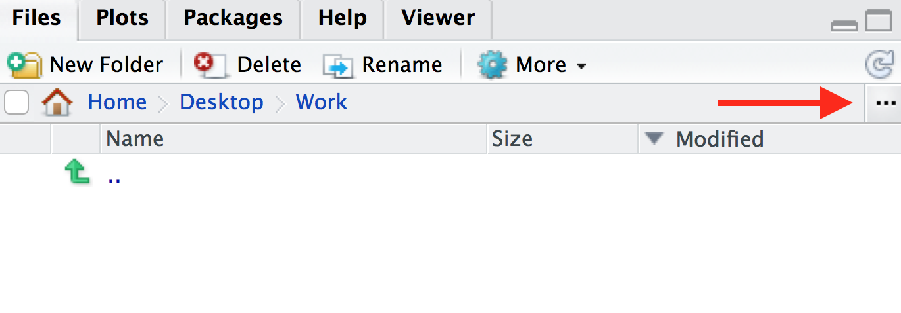

# R for Biologists course

R takes time to learn, like a spoken language. No one can expect to be an R expert after learning R for a few hours. This course has been designed to introduce biologists to R, showing some basics and some powerful things R can do. The aim is to give beginners the confidence to continue learning R, so the focus here is on tidyverse and visualisation of biological data, as we believe this is a productive and engaging way to start learning R.

# Intro to R and RStudio

RStudio is an interface that makes it easier to use R. There are four windows in RStudio. The screenshot below shows an [analogy linking the different RStudio windows to cooking](https://twitter.com/RLadiesNCL/status/1138812826917724160).


\  
\  
\  

## R script vs console

There are two ways to work in RStudio in the console or in a script. We can type a command in the console and press `Enter` to run it. Try running the command below in the console.

```{r}
1 + 1
```

Or we can use an R script. To create a script, from the top menu in RStudio: `File > New File > R Script`. Now type the command below in the script. This time, to run the command, you use `Ctrl` + `Enter` for Windows/Linux or `Cmd` + `Enter` for MacOS. This sends the commmand where the cursor is from the script to the console. You can highlight multiple commands and then press `Cmd/Ctrl` + `Enter` to run them one after the other.

```{r}
2 + 2
```

As the RStudio screenshot above explains, if we work in the console we don't have a good record (recipe) of what we've done. We can see commands we've run in the History panel (top right window), and we can go backwards and forwards through our history in the console using the up arrow and down arrow. But the history includes everything we've tried to run, including our mistakes so it is good practice to use an R script.

We can also add comments to a script. These are notes to ourself or others about the commands in the script. Comments start with a `#` which tells R not to run them as commands.

```{r}
# testing R
2 + 2
```

Keeping an accurate record of how you've manipulated your data is important for [reproducible research](https://ropensci.github.io/reproducibility-guide/sections/introduction/). Writing detailed comments and documenting your work are useful reminders to your future self (and anyone else reading your scripts) on what your code does.

## Working directory

Opening an RStudio session launches it from a specific location. This is the ‘working directory’. **R looks in the working directory by default to read in data and save files.** You can find out what the working directory is by using the command `getwd()`. This shows you the path to your working directory in the console. In Mac this is in the format `/path/to/working/directory` and in Windows `C:\path\to\working\directory`. It is often useful to have your data and R scripts in the same directory and set this as your working directory. We will do this now. 

Make a folder for this course somewhere on your computer that you will be able to easily find. Name the folder for example, `Intro_R_course`. Then, to set this folder as your working directory:

In RStudio click on the ‘Files’ tab and then click on the three dots, as shown below.



In the window that appears, find the folder you created (e.g. `Intro_R_course`), click on it, then click ‘Open’. The files tab will now show the contents of your new folder. Click on `More > Set As Working Directory`, as shown below.


Save the script you created in the previous section as `intro.R` in this directory. You can do this by clikcing on `File > Save` and the default location should be the current working directory (e.g. `Intro_R_course`).

## Packages

If it's not already installed on your computer, you can use the `install.packages` **function** to install a **package**.

```{r, eval=FALSE}
install.packages("tidyverse")
```

We will see many functions in this tutorial. Functions are "canned scripts" that automate more complicated sets of commands. Many functions are predefined, or can be made available by importing R packages. A function usually takes one or more inputs called *arguments*. Here tidyverse is the argument to the `install.packages()` function. **Note that functions require parentheses after the function name.**

## Getting help

To see what any function in R does, type a `?` before the name and help information will appear in the Help panel on the right in RStudio. Or you can search the function name in the Help panel search box. Google and Stack Overflow are also useful resources for getting help.

```{r, eval=FALSE}
?install.packages
```

> #### Tab completion
> A very useful feature is Tab completion. You can start typing and use <kbd>Tab</kbd> to autocomplete code, for example, a function name. 

## Common R errors

R error messages are common and can sometimes be cryptic. You most likely will encounter at least one error message during this tutorial. Some common reasons for errors are:

- Case sensitivity. In R, as in other programming languages, case sensitivity is important. ?install.packages is different to ?Install.packages.
- Missing commas
- Mismatched parentheses or brackets
- Not quoting file paths

To see examples of some R error messages with explanations see [here]( https://github.com/noamross/zero-dependency-problems/issues/7)


# Getting started with data


## Data files
The data files required for this workshop are available on [GitHub](https://github.com/mblue9/r-intro-biologists/blob/master/data.zip). To download the data.zip file, click the 'Download' button that's in the middle of the page. Unzip the file and store this `data` folder in your working directory.


## GREIN (GEO RNA-seq Experiments Interactive Navigator) 
In this tutorial, we will learn some R through creating plots to visualise data from an RNA-seq experiment. RNA-seq counts file can be obtained from the [GREIN platform](https://www.nature.com/articles/s41598-019-43935-8). GREIN provides >6,500 published datasets from GEO that have been uniformly processed. It is available at http://www.ilincs.org/apps/grein/. You can search for a dataset of interest using the GEO code. We obtained the dataset used here using the code GSE60450. GREIN provide QC metrics for the RNA-seq datasets and both raw and normalized counts. We will use the normalized counts here. These are the counts of reads for each gene for each sample normalized for differences in sequencing depth and composition bias. Generally, the higher the number of counts the more the gene is expressed.
\  
\ 

## RNA-seq dataset
Here we will create some plots using RNA-seq data from the paper by [Fu et al. 2015](https://www.ncbi.nlm.nih.gov/pubmed/25730472), GEO code GSE60450. This study examined expression in basal and luminal cells from mice at different stages (virgin, pregnant and lactating). There are 2 samples per group and 6 groups, 12 samples in total.


## Tidyverse

{width=100% }

The **tidyverse** is a collection of R packages that includes the extremely widely used **`ggplot2`**. 

\  
\  
\  

{width=50% }

\  
\  
\ 

**The [tidyverse](https://www.tidyverse.org/) makes data science faster, easier and more fun.**

\  
\  
\  


## Loading the data

We use `library()` to load in the packages that we need.

```{r, message=FALSE}
library(tidyverse)
```

The file we will use is a csv comma-separated file, so we will use the `read_csv()` function from the tidyverse. There is also a `read_tsv()` function for tab-separated values.

We will use the counts file called `GSE60450_GeneLevel_Normalized(CPM.and.TMM)_data.csv` that's in a folder called `data` i.e. the path to the file should be `data/GSE60450_GeneLevel_Normalized(CPM.and.TMM)_data.csv`.

We can read the counts file into R with the command below. We'll store the contents of the counts file in an **object** called `counts`. This stores the file contents in R's memory making it easier to use.

```{r}
# read in counts file
counts <- read_csv("data/GSE60450_GeneLevel_Normalized(CPM.and.TMM)_data.csv")

# read in metadata
sampleinfo <- read_csv("data/GSE60450_filtered_metadata.csv")
```

There is some information output by read_csv on "column specification". It tells us that there is a missing header and it has been filled with the name "X1". It also tells us what data types read_csv is detecting in each column. Columns with text charactershave been detected (col_character) and also columns with numbers (col_double). We won't get into the details of R data types in this tutorial but they are important to know and you can read more about them in the [R for Data Science book](https://r4ds.had.co.nz/vectors.html#important-types-of-atomic-vector).

In R we use `<-` to assign values to objects. `<-` is the **assignment operator**.  It assigns values on the right to objects on the left. So to create an object, we need to give it a name (e.g. `counts`), followed by the assignment operator `<-`, and the value we want to give it. We can give an object almost any name we want but there are some rules and conventions as described in the [tidyverse R style guide](https://style.tidyverse.org/syntax.html#object-names)

We can read in a file from a path on our computer on on the web and use this as the value. Note that we need to put quotes ("") around file paths.

> #### Assignment operator shortcut
> In RStudio, typing <kbd>Alt</kbd> + <kbd>-</kbd> (push <kbd>Alt</kbd> at the
> same time as the <kbd>-</kbd> key) will write ` <- ` in a single keystroke in a PC, while typing > <kbd>Option</kbd> + <kbd>-</kbd> (push <kbd>Option</kbd> at the
> same time as the <kbd>-</kbd> key) does the same in a Mac. 


## Getting to know the data

When assigning a value to an object, R does not print the value. For example, here we don't see what's in the counts or sampleinfo files. But there are ways we can look at the data. We will demonstrate using the `sampleinfo` object.

We can type the name of the object and this will print the first few lines and some information, such as number of rows. 

```{r}
sampleinfo
```

We can also use `dim()` to see the dimensions of an object, the number of rows and columns.

```{r}
dim(sampleinfo)
```

This show us there are 12 rows and 4 columns.

In the Environment Tab in the top right panel in RStudio we can also see the number of rows and columns in the objects we have in our session.

We can also take a look the first few lines with `head()`. This shows us the first 6 lines.

```{r}
head(sampleinfo)
```

We can look at the last few lines with `tail()`. This shows us the last 6 lines. This can be useful to check the bottom of the file, that it looks ok.
```{r}
tail(sampleinfo)
```

Or we can see the whole file with `View()`.

```{r eval=FALSE}
View(sampleinfo)
```

In the Environment tab we can see how many rows and columns the object contains and we can click on the icon to view all the contents in a tab. This runs the command View() for us.

We can see all the column names with `colnames()`.
```{r}
colnames(sampleinfo)
```

We can access individual columns by name using the `$` symbol. For example we can see what's contained in column X1.

```{r}
sampleinfo$X1
```

If we just wanted to see the first 3 values in the column we can specify this using square brackets.

```{r}
sampleinfo$X1[1:3]
```

Other useful commands for checking data are `str()` and `summary()`.

`str()` shows us the structure of our data. It shows us what columns there are, the first few entries, and what data type they are e.g. character or numbers (double or integer).

```{r}
str(sampleinfo)
```

`summary()` generates summary statistics of our data. For numeric columns (columns of type double or integer) it outputs statistics such as the min, max, mean and median. We will demonstrate this with the counts file as it contains numeric data. For character columns it shows us the length (how many rows).

```{r}
summary(counts)
```


# Formatting the data

We will first convert the data from wide format into long format to make it easier to work with and plot with ggplot.


```{r}
seqdata <- gather(counts, key = Sample, value = Count, starts_with("GSM"))
```

Let's have a look at the data.
```{r}
seqdata
```


Here we see the function `c()` for the first time. We use this function extremely often in R when we have multiple items that we are *combining*. We will see it again in this tutorial.

```{r}
allinfo <- full_join(seqdata, sampleinfo, by = c("Sample" = "X1"))
```

Let's have a look at the data.
```{r}
allinfo
```

# Plotting with **`ggplot2`**

**`ggplot2`** is a plotting package that makes it simple to create complex plots. One really great benefit of ggplot2 versus the older base R plotting is that we only need to make minimal changes if the underlying data change or if we decide to change our plot type, for example, from a box plot to a violin plot. This helps in creating publication quality plots with minimal amounts of adjustments and tweaking.

**`ggplot2`** likes data in the 'long' format, i.e., a column for every variable, and a row for every observation, similar to what we created with `gather()`. Well-structured data will save you lots of time when making figures with **`ggplot2`**. We will discuss tidy data more later in the course.

ggplot graphics are built step by step by adding new elements. Adding layers in this fashion allows for extensive flexibility and customization of plots.

To build a ggplot, we use the following basic template that can be used for different types of plots. Three things are required for a ggplot:


1. The data
2. The columns in the data we want to map to visual properties (called aesthetics or aes in ggplot2) e.g. the columns for x values, y values and colours
3. The type of plot (the geom_)

There are different geoms we can use to create different types of plot e.g. `geom_line()` `geom_point()`, `geom_boxplot()`. To see the geoms available see the ggplot2 help or the handy [ggplot2 cheatsheet](https://github.com/rstudio/cheatsheets/raw/master/data-visualization-2.1.pdf). 

We can make boxplots to visualise the distribution of the counts for each sample. This helps us to compare the samples and check if any look unusual.

```{r}
ggplot(data = allinfo, mapping = aes(x = Sample, y = Count)) + 
  geom_boxplot()
```

We have generated our first plot!

But it looks a bit weird. It's because we have some genes with extremely high counts. To make it easier to visualise the distributions we usually plot the logarithm of RNA-seq counts. We'll plot the Sample on the X axis and log~ 2~  Counts on the y axis. We can log the Counts within the `aes()`. (The sample labels are also overlapping each other, we will show how to fix this later)

```{r}
ggplot(data = allinfo, mapping = aes(x = Sample, y = log2(Count))) + 
  geom_boxplot()
```

Note that we get a warning here about rows containing non-finite values being removed. This is because some of the genes have a count of zero in the samples and a log of zero is undefined. We can add a small number to every count to avoid the zeros being dropped.

```{r}
ggplot(data = allinfo, mapping = aes(x = Sample, y = log2(Count + 1))) + 
  geom_boxplot()
```

The box plots show that the distributions of the samples are not identical but they are not very different.

Box plots are useful summaries, but hide the shape of the distribution. For example, if the distribution is bimodal, we would not see it in a boxplot. An alternative to the boxplot is the **violin plot**, where the shape (of the density of points) is drawn. See here for an example of how differences in distribution may be hidden in box plots but revealed with violin plots. We could also make jitter plots. A **jitter plot** is similar to a scatter plot. It adds a small amount of random variation to the location of each point so they don’t overlap. There are too many points in this case for the jitter plots to be useful but this is just to demonstrate, as [jitter with and without boxplot](https://simplystatistics.org/2019/02/21/dynamite-plots-must-die/) is a commonly used ggplot type. We will also make use of jitter plots later.

#### Exercise 
You can easily make different types of plots with ggplot by using different geoms. If you type "geom" in RStudio, RStudio will show you the different types of geoms you can use. Using the same data (same x and y values), try editing the code above to make the plots listed in 1. 2. and 3.

1. Make a violin plot (geom_violin)
2. Make a jitter plot (geom_jitter)
3. Make a boxplot with a jitter plot overlaid (Hint: you can add multiple geoms with + )

What if we would like to add some colour to the plot, for example, a different colour bar for each sample. 

If we look at the `geom_boxplot` help we can see under the heading called "Aesthetics" that there's an option for colour. Let's try adding that to our plot. We'll specify we want to map the Sample column to `colour = `. As we are mapping colour to a column in our data we need to put this inside the `aes()`.

```{r}
ggplot(data = allinfo, mapping = aes(x = Sample, y = log2(Count + 1), colour = Sample)) + 
  geom_boxplot()
```

Colouring the edges wasn’t quite what we had in mind. Look at the help for `geom_boxplot` to see what other aesthetic we could use. Let's try `fill = ` instead.

```{r}
ggplot(data = allinfo, mapping = aes(x = Sample, y = log2(Count + 1), fill = Sample)) + 
  geom_boxplot()
```

That looks better. `fill = ` is used to **fill** in areas in ggplot2 plots, whereas `colour = ` is used to colour lines and points.

A really nice feature about ggplot is that we can easily colour by another variable by simply changing the column we give to `fill = `.

#### Exercise 
Modify the plot above. Colour by other variables (columns) in the metadata file:

1. characteristics
2. immunophenotype
3. \`developmental stage\` (Check what happens if you don't use backticks)


# Make subplots for each gene

With ggplot we can easily make subplots using *faceting*. For example we can make stripcharts, plotting expression by the groups (basal virgin, basal pregnant, basal lactating, luminal virgin, luminal pregnant, luminal lactating) for each gene. 

First we'll use `mutate()` to add a column with shorter group names to use in the plot, as the group names in the characteristics column are quite long.

```{r}
 allinfo <- mutate(allinfo, Group = case_when(                                        
        str_detect(characteristics, "basal.*virgin") ~  "bvirg",
        str_detect(characteristics, "basal.*preg")  ~  "bpreg",
        str_detect(characteristics, "basal.*lact")  ~  "blact",
        str_detect(characteristics, "luminal.*virgin")  ~  "lvirg",
        str_detect(characteristics, "luminal.*preg")  ~  "lpreg",
        str_detect(characteristics, "luminal.*lact")  ~  "llact"
       ))
```

Have a look at this data using `head()`. You should see a new column called `Group` has been added to the end.

```{r}
head(allinfo)
```

We can make plots for a set of genes.

```{r}
mygenes <- c("Csn1s2a", "Csn1s1", "Csn2", "Glycam1", "COX1", "Trf", "Wap", "Eef1a1")
```

> #### Note on specifying genes
> This example is to demonstrate how we could specify any genes in the data to plot. The genes used here were the 8 genes with the highest counts summed across all samples. The command for how to get the gene symbols for these 8 genes is shown below.  
>allinfo %>%  
>  group_by(gene_symbol) %>%  
>  summarise(Total_count=sum(Count)) %>%  
>  arrange(desc(Total_count)) %>% 
>  head(n=8) %>% 
>  pull(gene_symbol) 

We filter our data for just these genes of interest.

```{r}
mygenes_counts <- filter(allinfo, gene_symbol %in% mygenes)
```


We can make boxplots for just these genes. We *facet* on the `gene_symbol` column using `facet_wrap()`. We add the tilde symbol `~ ` in front of the column we want to facet on. 

```{r}
ggplot(data = mygenes_counts, mapping = aes(x = Group, y = log2(Count), fill = Group)) +
  geom_boxplot() +
  facet_wrap(~ gene_symbol)
```

Here we only have two values per group so we could just plot the individual points. We could use 
`geom_point` to make a scatterplot.
```{r}
ggplot(data = mygenes_counts, mapping = aes(x = Group, y = Count)) +
  geom_point() +
  facet_wrap(~ gene_symbol)
```

The points are overlapping so we will use `geom_jitter` which adds a small amount of random variation.

```{r}
ggplot(data = mygenes_counts, mapping = aes(x = Group, y = Count)) +
  geom_jitter() +
  facet_wrap(~ gene_symbol)
```

We can colour the groups similar to before using `colour = `.

```{r}
ggplot(data = mygenes_counts, mapping = aes(x = Group, y = Count, colour = Group)) +
  geom_jitter() +
  facet_wrap(~ gene_symbol) 
```

# Customising the plot

### Specifying colours

We might want to change the colours. To see what colour names are available you can type `colours()`. There is also an [R colours cheatsheet](https://www.nceas.ucsb.edu/~ frazier/RSpatialGuides/colorPaletteCheatsheet.pdf) that shows what the colours look like.
```{r}
mycolours <- c("turquoise", "plum", "tomato", "violet", "steelblue", "chocolate")
```

Then we then add these colours to the plot using a `+` and `scale_colour_manual(values=mycolours)`.

```{r}
ggplot(data = mygenes_counts, mapping = aes(x = Group, y = Count, colour = Group)) +
  geom_jitter() +
  facet_wrap(~ gene_symbol) +
  scale_colour_manual(values = mycolours)
```

There are built-in colour palettes that can be handy to use, where the sets of colours are predefined. `scale_colour_brewer()` is a popular one (there is also `scale_fill_brewer()`). You can take a look at the help for `scale_colour_brewer()` to see what palettes are available. The [R colours cheatsheet](https://www.nceas.ucsb.edu/~ frazier/RSpatialGuides/colorPaletteCheatsheet.pdf) also shows what the colours of the palettes look like. There's one called "Dark2", let's have a look at that. 

```{r}
ggplot(data = mygenes_counts, mapping = aes(x = Group, y = Count, colour = Group)) +
  geom_jitter() +
  facet_wrap(~ gene_symbol) +
  scale_colour_brewer(palette = "Dark2")
```


#### Exercise
Make a colourblind friendly plot. Hint there are colourblind friendly palettes [here](http://www.cookbook-r.com/Graphs/Colors_(ggplot2)/#a-colorblind-friendly-palette)

### Axis labels and Title

We can change the axis labels and add a title with `labs()`. To change the x axis label we use `labs(x = "New name")`. To change the y axis label we use `labs(y = "New name")` or we can change them all at the same time.

```{r}
ggplot(data = mygenes_counts, mapping = aes(x = Group, y = Count, colour = Group)) +
  geom_jitter() +
  facet_wrap(~ gene_symbol) + 
  labs(x = "Cell type and stage", y = "Count", title="Mammary gland RNA-seq data")
```

### Themes

We can adjust the text on the x axis (the group labels by turning them 90 degrees so we can read the labels better.
```{r}
ggplot(data = mygenes_counts, mapping = aes(x = Group, y = Count, colour = Group)) +
  geom_jitter() +
  facet_wrap(~ gene_symbol) + 
  labs(x = "Cell type and stage", y = "Count", title = "Mammary gland RNA-seq data") +
  theme(axis.text.x = element_text(angle = 90))
```

We can remove the grey background and grid lines. To do this we modify the ggplot theme. Themes are the non-data parts of the plot. 

There are also a lot of built-in themes. Let's have a look at a couple of the more widely used themes. We won't save these (we won't use `p <-`) we'll just print them to have a look. The default ggplot theme is `theme_grey().`

```{r}
ggplot(data = mygenes_counts, mapping = aes(x = Group, y = Count, colour = Group)) +
  geom_jitter() +
  facet_wrap(~ gene_symbol) + 
  labs(x = "Cell type and stage", y = "Count", title = "Mammary gland RNA-seq data") +
  theme(axis.text.x = element_text(angle = 90)) + 
  theme_bw()
```

```{r}
ggplot(data = mygenes_counts, mapping = aes(x = Group, y = Count, colour = Group)) +
  geom_jitter() +
  facet_wrap(~ gene_symbol) + 
  labs(x = "Cell type and stage", y = "Count", title = "Mammary gland RNA-seq data") +
  theme(axis.text.x = element_text(angle = 90)) + 
  theme_minimal()
```

There are many themes available, you can see some in the [R graph gallery](https://www.r-graph-gallery.com/192-ggplot-themes/).

We can also modify parts of the theme individually. We can remove the grey background and grid lines with the code below.

```{r}
ggplot(data = mygenes_counts, mapping = aes(x = Group, y = Count, colour = Group)) +
  geom_jitter() +
  facet_wrap(~ gene_symbol) + 
  labs(x = "Cell type and stage", y = "Count", title = "Mammary gland RNA-seq data") +
  theme(axis.text.x = element_text(angle = 90)) + 
  theme(panel.background = element_blank(), 
        panel.grid.major = element_blank(), 
        panel.grid.minor = element_blank())
```

### Order of groups

The groups have been plotted in alphabetical order on the x axis and in the legend, however, we may want to change the order. We may prefer to plot the groups in order of stage, for example, basal virgin, basal pregnant, basal lactate, luminal virgin, luminal pregnant, luminal lactate.

First let's make an object with the group order that we want.
```{r}
group_order <- c("bvirg", "bpreg", "blact", "lvirg", "lpreg", "llact")
```

Next we need to make a column with the groups into an R data type called a **factor**. Factors in R are a special data type used to specify categories, you can read more about them in the [R for Data Science book](https://r4ds.had.co.nz/vectors.html#augmented-vectors). The names of the categories are called the factor **levels**. 

We'll add another column called "Group_f" where we'll make the Group column into a factor and specify what order we want the levels of the factor.


```{r}
mygenes_counts <- mutate(mygenes_counts, Group_f = factor(Group, levels = group_order))
```


Take a look by typing `mygenes_counts`.

```{r}
mygenes_counts
```

Notice that the Group column has `<chr>` under the heading, that indicates is a character data type, while the Group_f column has `<fct>` under the heading, indicating it is a factor data type. The `str()` command that we saw previously is useful to check the data types in objects.

```{r}
str(mygenes_counts)
```

`str()` shows us Group_f column is a Factor with 6 levels (categories).

We can check the factor levels of a column as below.

```{r}
levels(mygenes_counts$Group_f)
```

The levels are in the order that we want, so we can now change our plot to use the "Group_f" column instead of Group column (change `x = ` and `colour = `).

```{r}
ggplot(data = mygenes_counts, mapping = aes(x = Group_f, y = Count, colour = Group_f)) +
  geom_jitter() +
  facet_wrap(~ gene_symbol) + 
  labs(x = "Cell type and stage", y = "Count", title = "Mammary gland RNA-seq data") +
  theme(axis.text.x = element_text(angle = 90)) + 
  theme(panel.background = element_blank(), 
        panel.grid.major = element_blank(), 
        panel.grid.minor = element_blank())
```
We could do the similar if we wanted to have the genes in the facets in a different order. For example, we could add another column called "gene_symbol_f" where we make the gene_symbol column into a factor, specifying the order of the levels.

# Saving plots
We can save plots interactively by clicking Export in the Plots window. Or we can output plots to pdf using `pdf()` followed by `dev.off()`. We put our plot code after the call to `pdf()` and before closing the plot device with `dev.off()`.

Let's save our last plot.

```{r, eval=FALSE}
pdf("myplot.pdf")
ggplot(data = mygenes_counts, mapping = aes(x = Group_f, y = Count, colour = Group_f)) +
  geom_jitter() +
  facet_wrap(~ gene_symbol) + 
  labs(x = "Cell type and stage", y = "Count", title = "Mammary gland RNA-seq data") +
  theme(axis.text.x = element_text(angle = 90)) + 
  theme(panel.background = element_blank(), 
        panel.grid.major = element_blank(), 
        panel.grid.minor = element_blank())
dev.off()
```


# Exercises
1. Download the raw counts for this dataset
  a. Make a boxplot. Do the samples look any different to the normalised counts?
  b. Make subplots for the same set of 8 genes. Do they look any different to the normalised counts?
2. Download the normalised counts for the GSE63310 dataset from GREIN. Make boxplots colouring the samples using different columns in the metadata file.


# Key Points
- Tabular data can be loaded into R with the tidyverse functions `read_csv()` and `read_tsv()`
- Tidyverse functions such as `full_join()`, `gather()`, `mutate()`, `filter()` can be used to manipulate data
- A ggplot has 3 components: data (dataset), mapping (columns to plot) and geom (type of plot). Different types of plots include `geom_point()`, `geom_jitter()`, `geom_line()`, `geom_boxplot()`, `geom_violin()`.
- `facet_wrap()` can be used to make subplots of the data
- The aesthetics of a ggplot can be modified, such as colouring by different columns in the dataset, adding labels or changing the background


# Further Reading
[Intro to R and tidyverse](https://pmacdasci.github.io/r-intro-tidyverse/)  
[Top 50 Ggplot Visualisations]( http://r-statistics.co/Top50-Ggplot2-Visualizations-MasterList-R-Code.html)  
[R for Data Science](https://r4ds.had.co.nz/)
